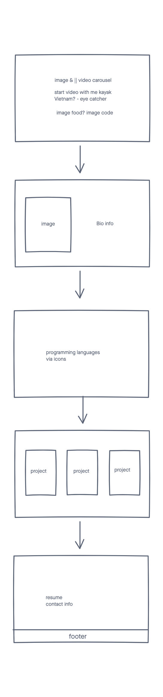

# Portfolio Lisa V. Wand

Date: February 7, 2021

By: Lisa Venneker Wand

[GitHub](https://github.com/LisaKVW) |
[LinkedIn](https://www.linkedin.com/in/lisa-venneker-wand-8413ab25/) 

## Description
Site to share Lisa's portfolio.

## Technologies used

## Getting Started
Have a look at Lisa's programming work and reach out if like you have any questions, or like to create something together.

## Wireframe

## Screenshots
Screenshots will be shared once site is ready and hosted

## Future Updates
- More exciting new projects 

## Credits
- Wireframe via Freehand: https://www.invisionapp.com/freehand
- Video cutter: https://online-video-cutter.com/ 